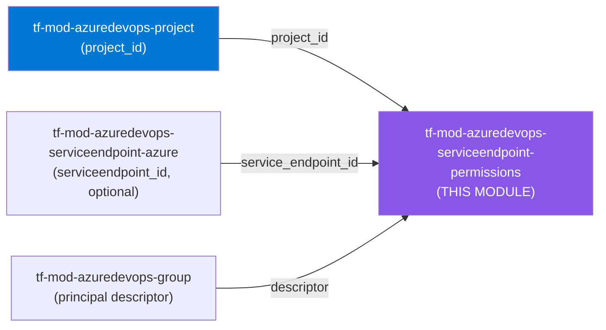
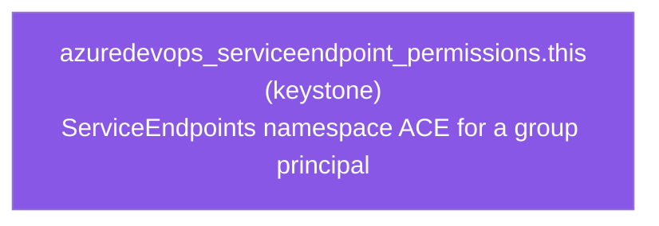

# 🔐 Azure DevOps **Service Endpoint Permissions** Terraform Module

> **Assigns service-connection (service endpoint) permissions to a group principal** — `azuredevops_serviceendpoint_permissions` — scoped either to a single endpoint or project-wide across all endpoints, with deeply-typed inputs, a closed-set permission-key validator, `Allow`/`Deny`/`NotSet` state enforcement, immutable-field guards, and a total `dynamic`-block `timeouts` renderer. Built for azuredevops **v1.x**.


---

## 🧩 Overview

This module creates and manages a single **service-endpoint permissions** assignment (an ACL entry on the `ServiceEndpoints` security namespace):

- 🔐 Grants a **group** principal a typed set of service-connection permissions — `Use`, `Administer`, `Create`, `ViewAuthorization`, `ViewEndpoint`.
- 🎯 Scopes the grant to **one specific endpoint** (`serviceendpoint_id`) **or project-wide** across all service connections (leave `serviceendpoint_id` null).
- ✅ Validates every permission **key** against the closed ServiceEndpoints action set and every **state** against `Allow` / `Deny` / `NotSet` — typos fail at plan time.
- 🔁 Supports authoritative **replace** (default) or additive **merge** (`replace = false`) of the principal's existing ACEs.
- ⏱️ Exposes typed Terraform operation `timeouts` (create / read / update / delete) rendered only when set.
- 📤 Emits `id` / `serviceendpoint_permissions_id`, plus `project_id`, `serviceendpoint_id`, and `principal` for audit and access review.

> **Why it matters:** Service connections hold the keys to your cloud — who may *use*, *create*, or *administer* them is a security control. Declaring those ACEs as code makes them reviewable, reproducible, and least-privilege by construction instead of hand-clicked in the portal.

> ℹ️ This module manages **permissions on** service endpoints — it does **not** create the endpoints themselves. Create endpoints with the `tf-mod-azuredevops-serviceendpoint-*` modules and wire their IDs in here.

---

## ❤️ Support this project

If these Terraform modules have been helpful to you or your organization, I'd appreciate your support in any of the following ways:

- ⭐ **Star this repository** to help others discover this Terraform module.
- 🤝 **Connect with me on LinkedIn:** [linkedin.com/in/microsoftexpert](https://www.linkedin.com/in/microsoftexpert)
- ☕ **Buy me a coffee:** [buymeacoffee.com/microsoftexpert](https://buymeacoffee.com/microsoftexpert)

Whether it's a star, a professional connection, or a coffee, every gesture helps keep these modules actively maintained and continually improving. Thank you for being part of the community!

---

## 🗺️ Where this fits in the family

This module is a **terminal ACL grant on a service connection** — it consumes the project, an optional specific endpoint, and a group principal, and nothing in this suite consumes its outputs as an input.



This module **consumes** `project_id` (from `tf-mod-azuredevops-project`), optionally `serviceendpoint_id` (from a `tf-mod-azuredevops-serviceendpoint-*` module — `null` ⇒ project-wide), and `principal` (a group descriptor from `tf-mod-azuredevops-group`); it **emits** `id` / `serviceendpoint_permissions_id` for audit and access-review tooling — see the [Typical wiring](#-typical-wiring) section. It is a terminal grant with no downstream module consumers in this suite.

---

## 🧬 What this module builds

A single service-endpoint permissions ACE, with Terraform operation `timeouts` rendered only when set.



---

## 📁 Module Structure

```
tf-mod-azuredevops-serviceendpoint-permissions/
├── providers.tf # Terraform >= 1.12.0, azuredevops >= 1.0, < 2.0 — no provider{} block
├── variables.tf # project_id, serviceendpoint_id, principal, permissions, replace, timeouts
├── main.tf # azuredevops_serviceendpoint_permissions.this + dynamic timeouts
├── outputs.tf # id, serviceendpoint_permissions_id, project_id, serviceendpoint_id, principal
├── SCOPE.md # in-scope resource, required scopes/auth, emits, gotchas
└── README.md
```

---

## ✅ Provider / Versions

| Requirement | Version |
|---|---|
| Terraform | `>= 1.12.0` |
| `microsoft/azuredevops` | `>= 1.0, < 2.0` (GA line v1.x) |

The module declares the provider **requirement** only — it configures **no** `provider "azuredevops" {}` block. The root/spec supplies the org URL and credentials (PAT or Microsoft Entra service principal).

---

## ⚙️ Quick Start

```hcl
module "endpoint_perms" {
  source = "git::https://github.com/microsoftexpert/tf-mod-azuredevops-serviceendpoint-permissions?ref=v1.0.0"

  project_id         = module.project.project_id
  serviceendpoint_id = module.serviceendpoint_azure.service_endpoint_id
  principal          = data.azuredevops_group.deployers.descriptor

  permissions = {
    Use          = "Allow"
    ViewEndpoint = "Allow"
  }
}
```

> ⚠️ Always pin the module with `?ref=v1.0.0` — never a branch. Tags are immutable; branches re-plan the world.

---

## 🔑 Required Azure DevOps Scopes / Auth

The Terraform identity (PAT or Microsoft Entra service principal) must be granted the following **before** `terraform apply` will succeed:

| Scope / Role | PAT scope | Service-principal role | Required for |
|---|---|---|---|
| Service connection security | **Service Connections (Read, Query & Manage)** (`vso.serviceendpoint_manage`) | **Endpoint Administrators** (project group) — or **Project Administrators** | Reading and writing the ACL on the `ServiceEndpoints` namespace for a specific endpoint |
| Project-level endpoint security | **Service Connections (Read, Query & Manage)** | **Project Administrators** | Editing **project-wide** service-connection security (when `serviceendpoint_id` is omitted) — including who may `Create` endpoints |
| Project read | Project and Team (Read) | Project member (Reader) | Resolving the `project_id` the assignment is scoped under |
| Principal lookup | Graph (Read) | Project / Reader | Resolving the group `descriptor` passed as `principal` (typically via the `azuredevops_group` data source) |

> ⚠️ **Editing project-level service-connection security requires Project Administrators.** Setting permissions at the project node (no `serviceendpoint_id`) governs *all* endpoints and the `Create` right — Azure DevOps requires **Project Administrators** group membership to change project-level resource permissions. Scoping to a single `serviceendpoint_id` requires only **Administrator** on that endpoint (e.g. **Endpoint Administrators**). Grant the least scope that fits.

---

## 🔌 Typical wiring

Derived from the module's Emits table — primary output is `id` / `serviceendpoint_permissions_id`.

| This module output | Feeds into |
|---|---|
| `id` / `serviceendpoint_permissions_id` | Downstream references; audit / access-review inventory |
| `project_id` | Sibling project-scoped modules; audit |
| `serviceendpoint_id` | Correlation back to the `tf-mod-azuredevops-serviceendpoint-*` module that created the endpoint (null ⇒ project-wide) |
| `principal` | Audit — the group descriptor that was granted access |

Common inbound wires:

| Input | Source |
|---|---|
| `project_id` | `tf-mod-azuredevops-project` (`project_id`) |
| `serviceendpoint_id` | `tf-mod-azuredevops-serviceendpoint-azure` / `_scm` / `_containers` / `_artifacts` / `_security` / `_generic` (`service_endpoint_id` / `id`) |
| `principal` | `tf-mod-azuredevops-group` (`descriptor`) or the `azuredevops_group` data source |

---

## 🧠 Architecture Notes

- **Project-scoped resource.** Service-endpoint permissions live inside a single project and **require** `project_id`. The `ServiceEndpoints` security namespace (ID `49b48001-ca20-4adc-8111-5b60c903a50c`) carries the actions; this module manages one ACE on it. (Org-scoped resources in this suite omit `project_id`; this one does not.)
- **Single endpoint vs. project-wide.** With `serviceendpoint_id` set, the ACE applies to that one endpoint. With it omitted (`null`), the ACE applies to the **project-level** service-connection node — governing all endpoints, plus the project-only `Create` right. The same five actions exist at both scopes; object-level roles inherit from the project level.
- **Group principals only.** The provider supports a **group** `descriptor` for `principal` — not individual users. Built-in groups like `[project]\Endpoint Administrators` (Administrator role) and `[project]\Endpoint Creators` (Creator role) are the usual targets; resolve descriptors via the `azuredevops_group` data source or `tf-mod-azuredevops-group`.
- **Three immutable fields.** `project_id`, `serviceendpoint_id`, and `principal` are force-new — changing any of them destroys and recreates the ACE. They are labelled `# IMMUTABLE` in the variable heredocs. Edit `permissions`/`replace` in place; re-target by recreating.
- **`replace` is authoritative vs. additive.** `replace = true` (default) makes `permissions` the full set for that principal — unlisted actions reset to inherited/`NotSet`. `replace = false` merges on top of existing ACEs. Prefer `true` for declarative, drift-free ACLs.
- **Least-privilege by omission.** There is **no default** `permissions` map (at least one entry is required), and omitting an action leaves it inherited rather than forcing `NotSet`. The type system rejects unknown action keys and any state other than `Allow`/`Deny`/`NotSet`.
- **Eventual consistency.** Azure DevOps security APIs are eventually consistent — a newly created endpoint or group may take a moment before its ACE is readable. The provider's default timeouts absorb this; raise them via the `timeouts` variable only if you observe transient read-after-write errors.
- **No secrets / no write-only fields.** This resource carries **no** tokens, passwords, or service-connection secrets — those live on the endpoint resources. The module therefore declares **no `sensitive` variables or outputs**. (The `principal` is a non-secret group descriptor.)
- **No Azure resource tags.** Azure DevOps resources do not support the azurerm `tags` pattern.

---

## 📚 Example Library (copy-paste)

<details>
<summary><b>1 · Minimal — grant Use on one endpoint</b></summary>

```hcl
module "endpoint_perms" {
  source = "git::https://github.com/microsoftexpert/tf-mod-azuredevops-serviceendpoint-permissions?ref=v1.0.0"

  project_id         = module.project.project_id
  serviceendpoint_id = module.serviceendpoint_azure.service_endpoint_id
  principal          = data.azuredevops_group.deployers.descriptor

  permissions = {
    Use = "Allow"
  }
}
```
</details>

<details>
<summary><b>2 · Project-wide — allow a group to create endpoints</b></summary>

```hcl
# No serviceendpoint_id ⇒ the project-level node (governs all endpoints + Create).
# Requires Project Administrators.
module "endpoint_perms" {
  source = "git::https://github.com/microsoftexpert/tf-mod-azuredevops-serviceendpoint-permissions?ref=v1.0.0"

  project_id = module.project.project_id
  principal  = data.azuredevops_group.endpoint_creators.descriptor

  permissions = {
    Use          = "Allow"
    Create       = "Allow"
    ViewEndpoint = "Allow"
  }
}
```
</details>

<details>
<summary><b>3 · Administrator on a specific endpoint</b></summary>

```hcl
module "endpoint_perms" {
  source = "git::https://github.com/microsoftexpert/tf-mod-azuredevops-serviceendpoint-permissions?ref=v1.0.0"

  project_id         = module.project.project_id
  serviceendpoint_id = module.serviceendpoint_azure.service_endpoint_id
  principal          = data.azuredevops_group.platform_admins.descriptor

  permissions = {
    Administer        = "Allow"
    Use               = "Allow"
    ViewAuthorization = "Allow"
    ViewEndpoint      = "Allow"
  }
}
```
</details>

<details>
<summary><b>4 · Read-only — view properties without use</b></summary>

```hcl
module "endpoint_perms" {
  source = "git::https://github.com/microsoftexpert/tf-mod-azuredevops-serviceendpoint-permissions?ref=v1.0.0"

  project_id         = module.project.project_id
  serviceendpoint_id = module.serviceendpoint_azure.service_endpoint_id
  principal          = data.azuredevops_group.auditors.descriptor

  permissions = {
    ViewEndpoint = "Allow"
  }
}
```
</details>

<details>
<summary><b>5 · Explicit Deny — block use for a group</b></summary>

```hcl
module "endpoint_perms" {
  source = "git::https://github.com/microsoftexpert/tf-mod-azuredevops-serviceendpoint-permissions?ref=v1.0.0"

  project_id         = module.project.project_id
  serviceendpoint_id = module.serviceendpoint_prod.service_endpoint_id
  principal          = data.azuredevops_group.contractors.descriptor

  permissions = {
    Use        = "Deny" # explicit Deny overrides inherited Allow
    Administer = "Deny"
  }
}
```
</details>

<details>
<summary><b>6 · Merge mode — add without resetting other actions</b></summary>

```hcl
module "endpoint_perms" {
  source = "git::https://github.com/microsoftexpert/tf-mod-azuredevops-serviceendpoint-permissions?ref=v1.0.0"

  project_id         = module.project.project_id
  serviceendpoint_id = module.serviceendpoint_azure.service_endpoint_id
  principal          = data.azuredevops_group.deployers.descriptor

  replace = false # merge — leaves unlisted actions untouched

  permissions = {
    ViewAuthorization = "Allow"
  }
}
```
</details>

<details>
<summary><b>7 · Authoritative replace (default) — full ACE for a principal</b></summary>

```hcl
module "endpoint_perms" {
  source = "git::https://github.com/microsoftexpert/tf-mod-azuredevops-serviceendpoint-permissions?ref=v1.0.0"

  project_id         = module.project.project_id
  serviceendpoint_id = module.serviceendpoint_azure.service_endpoint_id
  principal          = data.azuredevops_group.deployers.descriptor

  replace = true # default — unlisted actions reset to inherited/NotSet

  permissions = {
    Use          = "Allow"
    ViewEndpoint = "Allow"
    Administer   = "NotSet"
    Create       = "NotSet"
  }
}
```
</details>

<details>
<summary><b>8 · Custom timeouts</b></summary>

```hcl
module "endpoint_perms" {
  source = "git::https://github.com/microsoftexpert/tf-mod-azuredevops-serviceendpoint-permissions?ref=v1.0.0"

  project_id         = module.project.project_id
  serviceendpoint_id = module.serviceendpoint_azure.service_endpoint_id
  principal          = data.azuredevops_group.deployers.descriptor

  permissions = { Use = "Allow" }

  timeouts = {
    create = "10m"
    read   = "5m"
  }
}
```
Only the fields you set are rendered; the provider defaults apply otherwise.
</details>

<details>
<summary><b>9 · Principal wired from tf-mod-azuredevops-group</b></summary>

```hcl
module "deployers" {
  source     = "git::https://github.com/microsoftexpert/tf-mod-azuredevops-group?ref=v1.0.0"
  project_id = module.project.project_id
  #... group configuration...
}

module "endpoint_perms" {
  source = "git::https://github.com/microsoftexpert/tf-mod-azuredevops-serviceendpoint-permissions?ref=v1.0.0"

  project_id         = module.project.project_id
  serviceendpoint_id = module.serviceendpoint_azure.service_endpoint_id
  principal          = module.deployers.descriptor

  permissions = { Use = "Allow", ViewEndpoint = "Allow" }
}
```
</details>

<details>
<summary><b>10 · Built-in group via the azuredevops_group data source</b></summary>

```hcl
data "azuredevops_group" "endpoint_admins" {
  project_id = module.project.project_id
  name       = "Endpoint Administrators"
}

module "endpoint_perms" {
  source = "git::https://github.com/microsoftexpert/tf-mod-azuredevops-serviceendpoint-permissions?ref=v1.0.0"

  project_id         = module.project.project_id
  serviceendpoint_id = module.serviceendpoint_azure.service_endpoint_id
  principal          = data.azuredevops_group.endpoint_admins.descriptor

  permissions = { Administer = "Allow" }
}
```
</details>

<details>
<summary><b>11 · Many grants on one endpoint (for_each over groups)</b></summary>

```hcl
locals {
  endpoint_acls = {
    deployers = { group = "Deployers", perms = { Use = "Allow", ViewEndpoint = "Allow" } }
    admins    = { group = "Platform Admins", perms = { Administer = "Allow", Use = "Allow" } }
    auditors  = { group = "Auditors", perms = { ViewEndpoint = "Allow" } }
  }
}

data "azuredevops_group" "acl" {
  for_each   = local.endpoint_acls
  project_id = module.project.project_id
  name       = each.value.group
}

module "endpoint_perms" {
  source   = "git::https://github.com/microsoftexpert/tf-mod-azuredevops-serviceendpoint-permissions?ref=v1.0.0"
  for_each = local.endpoint_acls

  project_id         = module.project.project_id
  serviceendpoint_id = module.serviceendpoint_azure.service_endpoint_id
  principal          = data.azuredevops_group.acl[each.key].descriptor
  permissions        = each.value.perms
}
```
</details>

<details>
<summary><b>12 · Hardened — project-wide least privilege</b></summary>

```hcl
# Lock down who may create/administer endpoints project-wide; grant only Use to deployers.
module "endpoint_creators_lockdown" {
  source = "git::https://github.com/microsoftexpert/tf-mod-azuredevops-serviceendpoint-permissions?ref=v1.0.0"

  project_id = module.project.project_id
  principal  = data.azuredevops_group.contributors.descriptor
  replace    = true

  permissions = {
    Use          = "Allow"
    ViewEndpoint = "Allow"
    Create       = "Deny" # only Endpoint Creators/Admins may create
    Administer   = "Deny"
  }
}
```
</details>

<details>
<summary><b>13 · Cross-module wiring finale (project → group → endpoint → permissions)</b></summary>

```hcl
module "project" {
  source             = "git::https://github.com/microsoftexpert/tf-mod-azuredevops-project?ref=v1.0.0"
  name               = "Payments-Platform"
  visibility         = "private"
  version_control    = "Git"
  work_item_template = "Agile"
}

module "deployers" {
  source     = "git::https://github.com/microsoftexpert/tf-mod-azuredevops-group?ref=v1.0.0"
  project_id = module.project.project_id
  #... group configuration...
}

module "serviceendpoint_azure" {
  source     = "git::https://github.com/microsoftexpert/tf-mod-azuredevops-serviceendpoint-azure?ref=v1.0.0"
  project_id = module.project.project_id
  #... endpoint configuration...
}

module "endpoint_perms" {
  source = "git::https://github.com/microsoftexpert/tf-mod-azuredevops-serviceendpoint-permissions?ref=v1.0.0"

  project_id         = module.project.project_id # project-scoped wire-in
  serviceendpoint_id = module.serviceendpoint_azure.service_endpoint_id
  principal          = module.deployers.descriptor

  permissions = {
    Use          = "Allow"
    ViewEndpoint = "Allow"
  }
}

output "endpoint_perms_id" {
  value = module.endpoint_perms.serviceendpoint_permissions_id
}
```
</details>

---

## 📦 Inputs (high-level)

- **Parent / identity** — `project_id` (required, **IMMUTABLE**), `serviceendpoint_id` (optional, **IMMUTABLE**; `null` ⇒ project-wide), `principal` (required, **IMMUTABLE**, group descriptor)
- **The grant** — `permissions` (required `map(string)`; keys ∈ `Use`/`Administer`/`Create`/`ViewAuthorization`/`ViewEndpoint`, states ∈ `Allow`/`Deny`/`NotSet`)
- **Behavior** — `replace` (`bool`, default `true` — replace vs merge)
- **Operations** — `timeouts` (`create` / `read` / `update` / `delete`, all optional)

---

## 🧾 Outputs

- `id` — the permissions assignment ID (**primary output**)
- `serviceendpoint_permissions_id` — resource-specific ID (same value; for clean downstream wiring)
- `project_id` — the owning project ID
- `serviceendpoint_id` — the scoped endpoint ID, or `null` when project-wide
- `principal` — the group principal descriptor that was granted

> ℹ️ **No sensitive outputs.** This resource exposes no secrets, tokens, or keys — those live on the endpoint resources, not on their ACLs.

---

## 🧱 Design Principles

- **Make the type the contract** — permission keys are validated against the closed ServiceEndpoints action set and states against `Allow`/`Deny`/`NotSet`; a typo fails at plan time, not against the API.
- **`optional` with safe defaults** — `serviceendpoint_id` defaults to `null` (project-wide), `replace` to `true` (authoritative), `timeouts` to `{}`.
- **Least-privilege by omission** — no default `permissions`; at least one explicit entry is required, and omitting an action leaves it inherited.
- **Total renderer** — `timeouts` is a `dynamic` block emitted only when any field is set, with `try(x, null)` on every nested field.
- **Immutability labelled** — `project_id`, `serviceendpoint_id`, and `principal` are marked `# IMMUTABLE` in their heredoc descriptions.
- **Secure-by-omission** — no `tags`, no `resource_group_name`, no `object_id`; no `sensitive` fields because the resource has no secrets.

---

## 🚀 Runbook

```powershell
cd C:\GitHubCode\newazuredevopsmodules\tf-mod-azuredevops-serviceendpoint-permissions
terraform init -backend=false
terraform validate
terraform fmt -check
```

> **Note:** `terraform plan` / `apply` require live organization credentials (org URL + PAT, or a Microsoft Entra service principal). The offline gate above is sufficient for structural correctness. For live testing, use a **non-production** organization with a dedicated identity holding the scopes above. Never test against production.

---

## 🔍 Troubleshooting

| Symptom | Likely cause | Fix |
|---|---|---|
| 401 / 403 on apply | PAT lacks **Service Connections (Read, Query & Manage)**, or SP lacks **Endpoint Administrators** / **Project Administrators** | Grant the scope/role in the table above and retry |
| 403 only when `serviceendpoint_id` is omitted | Editing project-level endpoint security needs **Project Administrators** | Scope to a single `serviceendpoint_id`, or elevate the identity |
| `permissions keys must be one of …` at plan | A permission key is misspelled or not in the closed set | Use exactly `Use` / `Administer` / `Create` / `ViewAuthorization` / `ViewEndpoint` |
| `Every permissions value must be one of …` at plan | A state is not `Allow` / `Deny` / `NotSet` | Correct the state (case-insensitive) |
| Plan shows full replace after editing `project_id`, `serviceendpoint_id`, or `principal` | All three are **IMMUTABLE** (force-new) | Expected — recreate the ACE; don't mutate these in place |
| Grant "disappears" / unlisted actions reset | `replace = true` is authoritative | Use `replace = false` to merge, or list every action you intend to keep |
| `principal` not found | A user descriptor was passed, or the group descriptor is wrong | Pass a **group** descriptor (this resource doesn't accept users); resolve via `azuredevops_group` |
| Transient read-after-write / not-found errors | Eventual consistency in Azure DevOps security APIs | Re-run; raise `timeouts.read` / `timeouts.create` if persistent |
| Permissions don't take effect for a user | This resource targets **groups**; object roles inherit from project | Manage the user's group membership, or set the project-level node |

---

## 🔗 Related Docs

- [Manage security in Azure Pipelines — service connection security](https://learn.microsoft.com/azure/devops/pipelines/policies/permissions?view=azure-devops#set-service-connection-security-in-azure-pipelines)
- [Add an administrator for a protected resource — service connections](https://learn.microsoft.com/azure/devops/pipelines/library/add-resource-protection?view=azure-devops#service-connections)
- [Security namespace and permission reference — ServiceEndpoints namespace](https://learn.microsoft.com/azure/devops/organizations/security/namespace-reference?view=azure-devops#role-based-namespaces-and-permissions)
- [Service connections overview](https://learn.microsoft.com/azure/devops/pipelines/library/service-endpoints?view=azure-devops)
- [Provider: `azuredevops_serviceendpoint_permissions`](https://registry.terraform.io/providers/microsoft/azuredevops/latest/docs/resources/serviceendpoint_permissions)
- Sibling modules: `tf-mod-azuredevops-project`, `tf-mod-azuredevops-group`, `tf-mod-azuredevops-serviceendpoint-azure` (and the other `tf-mod-azuredevops-serviceendpoint-*` modules), `tf-mod-azuredevops-permissions`

---

> 💙 *"Infrastructure as Code should be standardized, consistent, and secure."*
